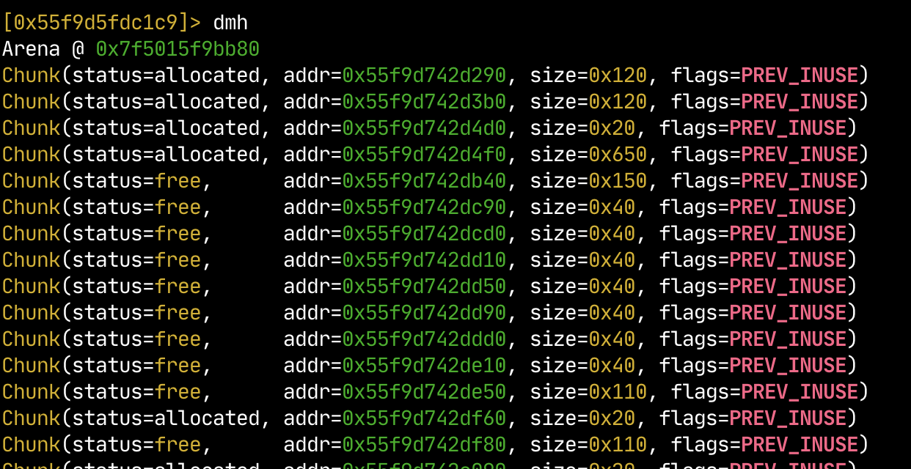
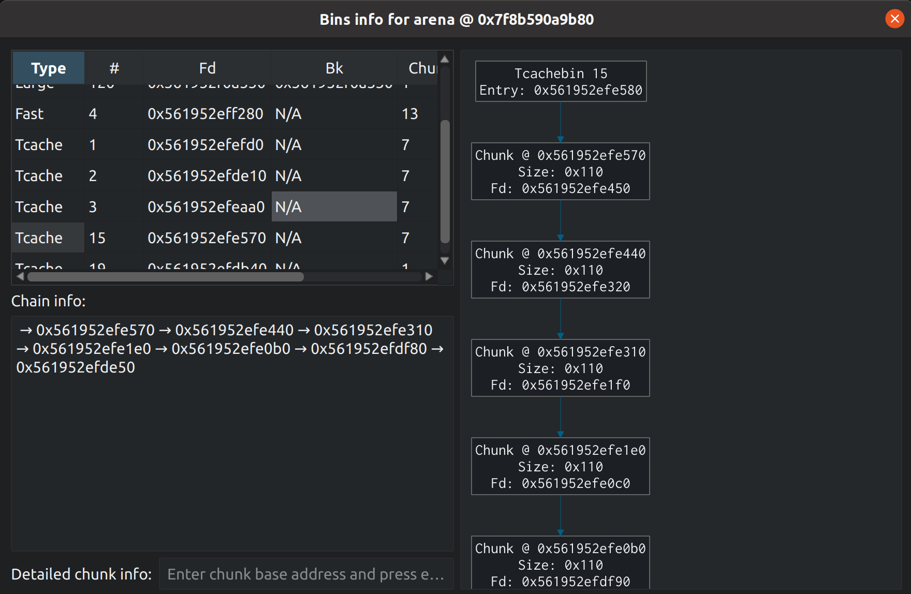

# Google Summer of Code 2021 Summary

[GSoC 2021](https://rizin.re/gsoc/2021) is officially finished and we are happy to congratulate all 3 participants for passing the program and completing the most important parts of their tasks.
It brought us some long-needed code cleanup and user-visible changes in the analysis and binary/heap parsing. See what students wrote themselves:

## 08A: Refactoring ELF binaries loading

This summer I have been doing the GSoC for Rizin. The subject of the GSoC was to refactor and improve how elf binaries are loaded by Rizin.

I have added support for the [elf hash table and gnu hash table](https://www.gabriel.urdhr.fr/2015/09/28/elf-file-format/#hash-tables). Those 2 data structures are used to deduct the number of dynamic symbols in the file, which replaced the old way of doing it (assuming that the data is a symbol until there is an error).

Moreover, I have changed the source of trust used to load symbols' versions (from sections information to dynamic section's information). So Rizin is now able to read symbols' versions even if there is no section.

```
> rz-bin -V bins/elf/analysis/clark
WARNING: Invalid section header (check array failed).
Version symbols has 9 entries:
 Addr: 0x080482c2  Offset: 0x000002c2
  0x00000000: 0 (*local*)
  0x00000001: 2 (GLIBC_2.0)
  0x00000002: 2 (GLIBC_2.0)
  0x00000003: 0 (*local*)
  0x00000004: 2 (GLIBC_2.0)
  0x00000005: 2 (GLIBC_2.0)
  0x00000006: 2 (GLIBC_2.0)
  0x00000007: 2 (GLIBC_2.0)
  0x00000008: 1 (*global*)


Version need has 1 entries:
 Addr: 0x080482d4  Offset: 0x000002d4
  0x000002d4: Version: 1  File: libc.so.6  Cnt: 1
  0x000002e4:   Name: GLIBC_2.0  Flags: none Version: 2
```

There was a hard-coded maximum length for all string found in any elf string table. This limitation was removed and some small check of the string table integrity were added.

```
> rizin bins/elf/long-symbol.elf
WARNING: Neither hash nor gnu_hash exist. Falling back to heuristics for deducing the number of dynamic symbols...
WARNING: Neither hash nor gnu_hash exist. Falling back to heuristics for deducing the number of dynamic symbols...
WARNING: Neither hash nor gnu_hash exist. Falling back to heuristics for deducing the number of dynamic symbols...
 -- Add custom Have you setup your ~/.rizinrc today?
[0x00001040]> is~AAA
28  0x00001139 0x00001139 GLOBAL FUNC   15       AAAAAAAAAAAAAAAAAAAAAAAAAAAAAAAAAAAAAAAAAAAAAAAAAAAAAAAAAAAAAAAAAAAAAAAAAAAAAAAAAAAAAAAAAAAAAAAAAAAAAAAAAAAAAAAAAAAAAAAAAAAAAAAAAAAAAAAAAAAAAAAAAAAAAAAAAAAAAAAAAAAAAAAAAAAAAAAAAAAAAAAAAAAAAAAAAAAAAAAAAAAAAAAAAAAAAAAAAAAAAAAAAAAAAAAAAAAAAAAAAAAAAAAAAAAAAAAAAAAAAAAAAAAAAAAAAAAAAAAAAAAAAAAAAAAAAAAAAAAAAAAAAAAAAAAAAAAAAAAAAAAAAAAAAAAAAAAAAAAAAAAAAAAAAAAAAAAAAAAAAAAAAAAAAAAAAAAAAAAAAAAAAAAAAAAAAAAAAAAAAAAAAAAAAAAAAAAAAAAAAAAAAAAAAAAAAAAAAAAAAAAAAAAAAAAAAAAAAAAAAAAAAAAAAAAAAAAAAAAAAAAAAAAAAAAAAAAAAAAA
```

The main problem with how symbols and imports were loaded, was their mutual dependency during the loading phase. So both processes was split and heavily refactored. As a side effect, an old bug on the symbols loading was fixed.

The call to the function system is correctly identified:
```
> rizin bins/elf/analysis/phdr-override
WARNING: The segment 3 at 0x774 seems to be invalid.
WARNING: Neither hash nor gnu_hash exist. Falling back to heuristics for deducing the number of dynamic symbols...
WARNING: Neither hash nor gnu_hash exist. Falling back to heuristics for deducing the number of dynamic symbols...
WARNING: Neither hash nor gnu_hash exist. Falling back to heuristics for deducing the number of dynamic symbols...
 -- Change your fortune types with 'e cfg.fortunes.file=fun,tips' in your ~/.rizinrc
[0x004003f0]> s main
[0x004004e6]> af
[0x004004e6]> pdf
┌ int main (int argc, char **argv, char **envp);
│           ; var int64_t var_10h @ rbp-0x10
│           ; var int64_t var_4h @ rbp-0x4
│           ; arg int argc @ rdi
│           ; arg char **argv @ rsi
│           0x004004e6      push  rbp
│           0x004004e7      mov   rbp, rsp
│          0x004004ea      sub   rsp, 0x10
│           0x004004ee      mov   dword [var_4h], edi                  ; argc
│           0x004004f1      mov   qword [var_10h], rsi                 ; argv
│           0x004004f5      mov   rax, qword [var_10h]
│           0x004004f9      add   rax, 8
│           0x004004fd      mov   rax, qword [rax]
│           0x00400500      mov   rdi, rax
│           0x00400503      mov   eax, 0
│           0x00400508      call  sym.imp.system                       ; int system(const char *string)
│           0x0040050d      mov   eax, 0
│           0x00400512      leave
└           0x00400513      ret
```

During the loading phase, sections and segment information checks have been added to verify the integrity of the data. Those checks are stricter than the elf loader. So 3 configurations variable were implemented to allow the user to customize how segments and sections are loaded.

```
> rizin bins/elf/analysis/phdr-override
WARNING: The segment 3 at 0x774 seems to be invalid.
WARNING: Neither hash nor gnu_hash exist. Falling back to heuristics for deducing the number of dynamic symbols...
WARNING: Neither hash nor gnu_hash exist. Falling back to heuristics for deducing the number of dynamic symbols...
WARNING: Neither hash nor gnu_hash exist. Falling back to heuristics for deducing the number of dynamic symbols...
 -- Press 'C' in visual mode to toggle colors
[0x004003f0]>

> rizin -e elf.checks.segments=false bins/elf/analysis/phdr-override
WARNING: Neither hash nor gnu_hash exist. Falling back to heuristics for deducing the number of dynamic symbols...
WARNING: Neither hash nor gnu_hash exist. Falling back to heuristics for deducing the number of dynamic symbols...
WARNING: Neither hash nor gnu_hash exist. Falling back to heuristics for deducing the number of dynamic symbols...
 -- Add colors to your screen with 'e scr.color=X' where 1 is 16 colors, 2 is 256 colors and 3 is 16M colors
[0x004003f0]>
```

There is still a lot of work to do, specially on the elf plugin interface. If you want to follow the update on this, you can use this link: [Refactoring the elf plugin interface](https://github.com/rizinorg/rizin/pull/1478)

In conclusion, the GSoC was an incredible source of motivation to contribute to the Open Source community. And it helped me improve my knowledge of elf internals. I would like to thank my mentors Anton Kochkov and Florian Märkl for their help during the GSoC.

## Pulak: Heap viewer for Cutter

Hi, I am Pulak Malhotra. Over the past few months, I participated in GSoC with the Rizin organization. My main contributions revolve around the heap parsing code for Rizin and the GUI implementation of heap viewer for Cutter.
The initial work started with improving the output format of the `dmh` family of commands. I made them much more readable, taking inspiration from `gdb gef`. I added a new command, `dmhd`, which prints concise information about different bins of a given arena. I also refactored and rewrote a significant part of the Glibc heap codebase, making it more modular and maintainable, including porting it to the new shell.


I added new Rizin API calls and used them in Cutter to implement the GUI version of the heap viewer. Heap viewer in Cutter has many features, like getting a list of heap chunks in an arena, editing the heap chunks, getting information about bins in the arena, and visualizations for linked lists of the bins. I encourage everyone to give it a try in their next heap exploitation hack!


After Glibc heap, I made some contributions towards the windows heap and windows heap widget. Some of the changes have been merged, like the Rizin API and the new shell port. I'll try my best to ship the other modifications to production soon.

GSoC was one of my first experiences working on a real-world project, and I learned and grew a lot. I want to give special thanks to my mentors Yossizap and Megabeets, and the Rizin community members XVilka, Ret2libc, Wargio, Gustavolcr, and Thestr4ng3r, who were always there to answer my questions and review and give feedback for my PRs.

## Aswin: Support for CPU and platform profiles

Hello everybody!

I'm Aswin and this is a brief summary about the work I did on the summer of 2021 with Rizin on
adding support for CPU and platform profiles. Rizin previously relied upon manually writing code
for adding a new CPU or an IO port and it was a bit tedious to handle them all and it was not
user friendly. Providing a level of abstraction in handling this entropy in embedded systems by
adding support for editable CPU and platform profiles was the goal of this project.

After getting accepted, the first thing I did was to remove the existing implementation of
`RzSyscallPorts` - the module which took care of the architecture and CPU specefic system
registers. Here, I made two new modules: `RzSysregsDB` and `RzSysregItem` to make this happen.
`RzSysregsDB` just housed a hashtable which paired the address of the port and an `RzSysregItem`
 which contained the comment, type and all the other information related it.

Then, I started working on CPU profiles. The whole idea of CPU profiles is to store all the CPU specefics in one file, parse it and use it
at places like analysis, emulation and wherever it's needed. Inside CPU profiles,
we store information like size of the ROM, size of the RAM CPU and other things and they
are parsed and stored into various data structures inside `RzArchProfile`, where `RzArchTarget`
houses the name of the CPU and architecture and a pointer to `RzArchProfile`. Information about
the CPU IO registers and Extended IO registers can also be added in CPU profiles. During the
analysis loop, they are added as flags (labels) at their corresponding offsets. A feature to map the ROM as sections (`iS`) were also added with it.

This is how the IO and extended IO registers are defined in the SDB files:

```
SPH=reg
SPH.address=0x3e
SPH.comment=Stack higher bits SP8 SP10
```

After that, I added support for platform profiles. Platform profiles were introduced to handle the platform specefic differences. These files
contains the name, offset and a short description of each port or register, which are parsed and
added as flags and comments. Support for one platforms like BCM2835, which one of the Raspberry Pi
runs on, BCM2711 and OMAP 3430 were added along with the x86 IO ports were added subsequently.

A new configuration variable `asm.platform` was also added
to choose the platform profile. This will let the user choose the name of the profile they want to load and Rizin will load the
profile based upon the CPU and the architecture that the user have previously set. For that, I added a new variable `platforms`
to `RzAsmPlugin` which will hold the list of all supported platforms of that architecture.

Platform Profiles also follow a format similar to the CPU profiles that you saw earlier.
Here's an excerpt BCM 2835's platform profile:

```xml
AUX_MU_IER_REG=name
AUX_MU_IER_REG.address=0x7e215044
AUX_MU_IER_REG.comment=Mini UART Interrupt Enable

AUX_MU_IIR_REG=name
AUX_MU_IIR_REG.address=0x7e215048
AUX_MU_IIR_REG.comment=Mini UART Interrupt Identify
```
Then, I worked on porting [uefi_r2](https://github.com/binarly-io/uefi_r2) - a tool used to analyze UEFI modules to Rizin.
This tool works by analyzing the firmware using Rizin's `RzAnalysis` utilities and inspecting its functions,
strings and all (For example, while searching for the UEFI guilds). Here, the tool is a Python package
and all the interaction with `rizin` is done through `rz-pipe`'s Python module. Overall, this was not particularly challenging
but it was indeed very informative. UEFI is insanely complex!

Later, I continued to work on improving the SVD parser plugin I had started making during the microtask.
SVD files are files containing information about a device's peripherals, MMIO registers and other particulars. They are usually
made by the manufacturer. This plugin would load the data from SVD file to Rizin mainly the registers' name, size, base address and its offset and adds them as flags and comments.

I would like to thank my mentors [xvilka](https://github.com/xvilka) and [wargio](https://github.com/wargio) for their guidance.
I was regularly in touch with them and they were constantly trying make sure that everything was going smooth.

Also kudos to all the folks at `#Rizin-dev`, `#gsoc-2021` and the other channels where my questions were answered.
