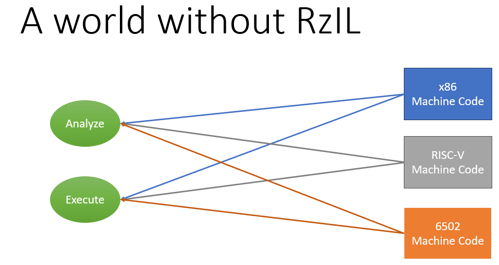
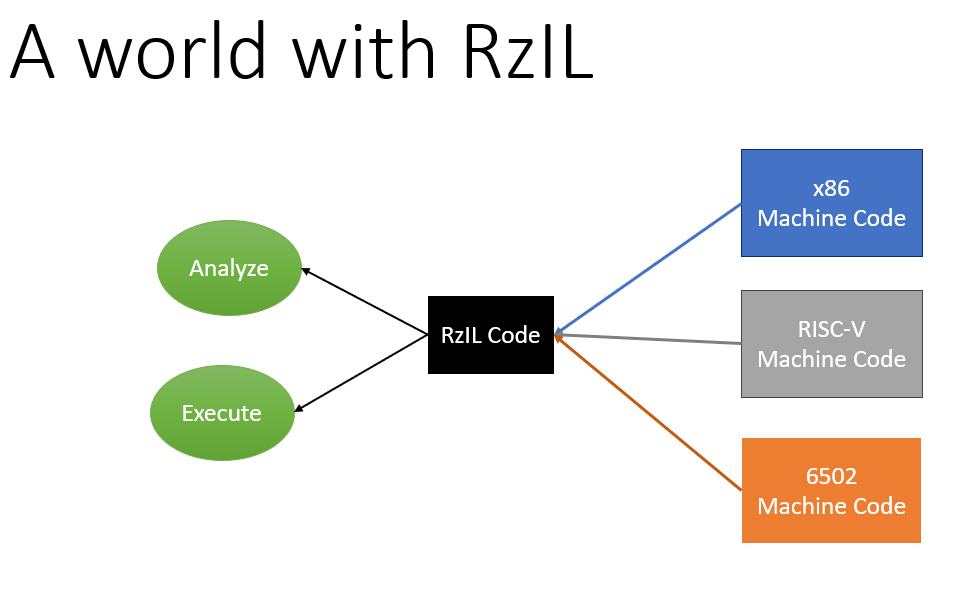
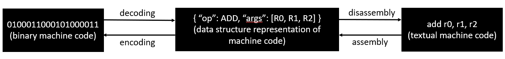

Hello, I’m Mostafa. I graduated with Excellence from Cairo University’s Faculty of Engineering, Computer Engineering Department, class of 2023. I write C++ for a living. I love systems programming, metaprogramming & DSLs, as well as Compilers & VMs. You can find me @[Github](https://github.com/moste00), and @[Linkedin](www.linkedin.com/in/mostafa-m-kamal-b015691b1).

I was honored to participate again as a contributor in the 2024 GSoC with the Rizin Organization. The original project was implementing binary lifting techniques for RISC-V instructions onto Rizin's custom internal representation, called RzIL. However, updating the RISC-V Capstone disassembler (originally a small task in the project preamble) turned out to need much more work than expected, and blocked the rest of the project.

Let's start at the beginning.

# RISC-V… Lifting?
***Lifting*** is a term of art in compiler research and implementation, it refers to any process that takes as input a low-level machine code program and outputs a higher-level program. The reverse process, ***lowering***, is what compilers do when they compile from a relatively high level language like C or LLVM IR to machine code. So you could simply think of lifting as a synonym for “Decompiling” or “Reverse-Compiling”. 

In the context of Rizin, lifting refers to transforming a machine code program written for any of the hardware architectures that Rizin understands (x86, RISC-V, 6502, etc...) to a Rizin-specific intermediate language called RzIL. 

By doing this, Rizin’s developers can write generic analysis algorithms that interpret RzIL instructions, and a generic VM that executes them, only once. Then, for each architecture that Rizin supports, a lifter that transforms machine code written for that architecture into RzIL is written, and as a result we get all the analysis algorithms and VM execution capabilities “for free”. 

In a nutshell, RzIL is the universal “Lingua Franca” for Rizin, like English is for Software Engineering.



Figure 1: Without RzIL, there is no smarter way to perform N operations for M assembly languages other than doing an NxM amount of work, implementing the N operations over and over again per each language/architecture.


Figure 2: With RzIL, the amount of work to support N operations for M architectures is N+M, the N operations are written exactly once for the intermediate language, then M transformers are written to lift each of the M architectures to the intermediate language.

# For want of a disassembler

So the original plan was to write the grey arrow in the figure above: a lifter from RISC-V machine code into RzIL. However, the first step in doing that is to “parse” RISC-V instructions from their binary form into a convenient data structure. We call that “parsing” step disassembly, or, more accurately, decoding.

>> Side Note:  lots of people, when “disassembly” and “assembly” are mentioned, will probably think of the following diagram:

This is not wrong for most purposes. However, in the context of this writeup it’s better to have the following and more detailed picture in mind:

In this writeup I’m more interested in the left-to-right flow: decoding from a binary to a structured (e.g. C struct) representation of the instruction, then assembling the structured representation of the instruction into a string form. Confusingly, sometimes “Disassembly” is used to include both Disassembly **and** Decoding, for example in Capstone the structured representation includes as a member its own `toString` serialization. It will often be clear from context what step is meant, and decoding is often far more important than disassembly. 

Where were we? Ah yes, we were supposed to “parse” (i.e. decode) an instruction from its binary form into a convenient data structure, so that we can write elegant code that easily and robustly lifts it into RzIL. 

The good news is that Rizin already has a RISC-V decoder/disassembler, since it uses as a library the project *Capstone*, which is a general-purpose disassembler framework for multiple architectures, including RISC-V.

The bad news? The RISC-V disassembler was incomplete and out of date. 

You won't catch it missing a variant of an ADD or a SUB, not even MULs or DIVs, but you ***can*** catch it missing the [zba, clz, or xnor](https://www.ece.lsu.edu/ee4720/doc/riscv-bitmanip-1.0.0.pdf) instructions, for example. Those, respectively, accelerate array indexing, count leading zeros, and perform an exclusive NOR. Capstone's current RISC-V [disassembler](https://github.com/capstone-engine/capstone/blob/9907b22d33693f3beb4b8b7ba261fbdd219afee3/include/capstone/riscv.h) includes none of those instructions. We could argue whether those instructions are really "Useful" or "Common" in real software: but at the end of the day they're part of RISC-V, and any compliant RISC-V tool must be aware of them. Capstone sometimes also chokes on quite [basic](https://github.com/capstone-engine/capstone/issues/2278) instructions, like LOAD.


>> RISC-V has a somewhat unusual approach to ISA evolution: it embraces extensions openly in its standard. Most architectures define new "versions" or "editions" whenever they change, RISC-V instead defines self-contained "modules" of behaviour and ISA state, even opening the door to vendors (companies selling SoCs and other products with RISC-V cores) to make their own vedor-defined extensions that co-exist with the rest of the architecture and its standard extensions. Each extension as well as the base architecture could evolve through different versions indepedently from other extensions. The RISC-V architecture is thus more of a family of architectures specified together rather than a single one.

Capstone was originally written based on codegen logic from LLVM. It’s essentially a port of LLVM disassembly logic from C++ to C (along with much simplification and cleaning up). Unfortunately, LLVM keeps updating that logic to reflect the fast-moving development and evolution of the architectures; those updates are not magically reflected back into Capstone! To make matters even worse, even LLVM proper can’t completely keep up with all the updates that happen to all the architectures it supports, it lags.

The Capstone project maintains an [update tool](https://rizin.re/posts/auto-sync/) called [Auto-Sync](https://github.com/capstone-engine/capstone/blob/next/suite/auto-sync/intro.md), which can semi-automatically synchronize changes from LLVM to Capstone (using Tree-sitter magic). Alas, it can only do that for some architectures, and RISC-V is not among the supported ones. Also, we already saw how even LLVM is not completely on top of all updates. Fortunately, the solution exists, just hiding elswhere.


# To Sail the high seas and RISC it all
The problem of describing Instruction Set Architectures (ISAs) accurately so that we can do plenty of useful things to them (assembly, disassembly, emulation, codegen, etc…) faces many projects and researchers, so much so that some smart people have developed an entirely new special language for it, Sail. Sail is a language designed specifically to address the problem of describing all aspects of ISAs: how the instructions are encoded into binary, how they execute, etc…

Now, if only there was a project that used Sail to describe RISC-V… wait, there is! It’s called Sail-RISCV. It’s such a complete and up-to-date description of RISC-V that the RISC-V foundation adopted it as the official source of truth for the architecture, this means that however the Sail code behaves, is - by definition - how RISC-V should behave.

>> Other architectures modelled in Sail are several versions of [ARM](https://github.com/rems-project/sail-arm/tree/master), a considerable part of [x86](https://github.com/rems-project/sail-x86-from-acl2), and a research version of MIPS called [CHERI-MIPS](https://github.com/CTSRD-CHERI/sail-cheri-mips), which includes hardware extensions to assist and accelerate memory safe pointers. The ARM and x86 models are auto-generated from other descriptions, and all 3 models are much less active than RISC-V's.

Let’s see a snippet of what Sail looks like in practice, here’s the definition of RISC-V IType (immediate) instructions:


The rule might be as cryptic as latin if you’re not used to pattern-matching constructs from functional languages, but what it’s saying is simply the following:
1. If the first (least-significant) 7 bits of the 32-bit instruction are: 0010011
2. And if the 3 bits from bit 12 to bit 14 are in the table encdec_iop
3. Then, the operation specified by this instruction is whatever enum corresponding to bits 12:14 in the encdec_iop table, and the args are:
    * The 5-bit register index **rd** in bits 7 through 11
    * The 5-bit register index **rs1** in bits 15 through 19
    * The 12-bit literal **imm** in bits 20 through 31
4. Otherwise, if (1) and (2) are not true, keep checking the 32-bit binary instruction against other rules

>> In case you’re wondering what regidx is, it’s an alias for the type of 5-bit integers (or, as Sail calls them, bitvectors). Sail-RISCV uses it to refer to registers everywhere because register files in RISC-V always have 32 registers. 

>> In case you’re wondering about the double arrow, that’s because this rule is a clause in a “Mapping”, a Sail innovation that basically means a bidirectional function: it can be used to decode binary instructions into structured objects, and to encode structured objects into binary instructions (that’s why it’s called encdec!).

Sail-RISCV contains ~280-290 rules of this form, and hundreds of other rules, sub-rules, and varied logic describing how RISC-V instructions are assembled, executed, how memory is accessed, how privliege levels and syscalls work, and so on.

We want this information, and we want it in C. We could port it by hand into C (good luck finishing in 2/3 years :(), or… we can use trusty code generation.

# RISC-V Auto-Sync
So this is what my GSoC project this year was all about: 
1. Use Sail’s compiler (written in OCaml) as a library to load, parse, and typecheck Sail-RISCV
2. Process the AST of Sail-RISCV and generate data structures representing the important logic
3. Generate C code from those data structures
 
That is, the code I wrote transformed the rule above into the following C code:

```c
// ---------------------------ITYPE-------------------------------
  {
    if (((binary_stream & 0x000000000000007F) == 0x13)) {
      uint64_t op = 0xFFFFFFFFFFFFFFFF;
      switch ((binary_stream & 0x0000000000007000) >> 12) {
      case 0x7:
        op = RISCV_ANDI;
        break;
      case 0x3:
        op = RISCV_SLTIU;
        break;
      case 0x2:
        op = RISCV_SLTI;
        break;
      case 0x6:
        op = RISCV_ORI;
        break;
      case 0x4:
        op = RISCV_XORI;
        break;
      case 0x0:
        op = RISCV_ADDI;
        break;
      }
      if (op != 0xFFFFFFFFFFFFFFFF) {
        uint64_t rd = (binary_stream & 0x0000000000000F80) >> 7;
        uint64_t rs1 = (binary_stream & 0x00000000000F8000) >> 15;
        uint64_t imm = (binary_stream & 0x00000000FFF00000) >> 20;
        tree->ast_node_type = RISCV_ITYPE;
        tree->ast_node.itype.imm = imm;
        tree->ast_node.itype.rs1 = rs1;
        tree->ast_node.itype.rd = rd;
        tree->ast_node.itype.op = op;
        return;
      }
    }
  }
  //------------------------------------------------------------
```

This low-level soup of shifts and masks performs the exact logic described in the Sail snippet earlier, just in C. It continues on like that for 9K lines of generated code (`#include`ing approximately 2K lines of generated AST definition).

In addition to this, the logic that disassembles the decoded structured objects into strings is also translated. Overall, the generated code is about 20K of C, but it’s still not finished yet.

# Loose Ends

The 20K of [generated C code](https://github.com/capstone-engine/capstone/pull/2498) is still not merged into Capstone. Before merging, it must first incorporate additional logic into the generated decode functions, it must also infer the type of each operand (whether it’s a register, a memory address, or a literal. If it’s a register, is it floating point or integer, etc…). Those details can easily consume another writeup, but they're all managable.

The [generator](https://github.com/rizinorg/capstone-autosync-sail) itself is ~2500 lines of idiomatic (I hope) OCaml. But since Sail is a complex language, the tool must make some assumptions about the input that might not survive the evolution of Sail-RISCV, the application to other Sail models, or the active evolution of Sail itself. 

Finally, we haven’t addressed the original problem yet! I hope to eventually and finally write the grey arrow in the first diagram: Lifting RISC-V instructions to RzIL code.

# Conclusion

Let’s summarize this rollercoaster journey:

1. We just wanted to write a binary lifter for RISC-V instructions into RzIL, Rizin’s intermediate language.
2. But in order to do that, we first have to have an up-to-date RISC-V decoder/disassembler.
3. Rizin depends on Capstone for RISC-V disassembly, but Capstone RISC-V disassembly logic is ported from old LLVM logic that is not up-to-date.
4. Even modern LLVM is not completely up-to-date with RISC-V.
5. But Sail-RISCV is, and it's adopted by the RISC-V foundation as the most authoritative model of the RISC-V architecture.
6. And thus, we can generate a Capstone disassembler module from Sail-RISCV, by depending on the Sail compiler as a library.

It was fun. Frustrating and long-winded at times, but what kind of programming isn’t? That’s part of the thrill anyway!

That's all and Happy Christmas! Keep coding through the wind and the snow. 

