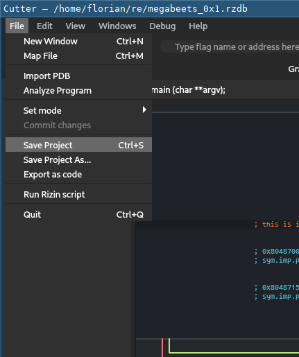
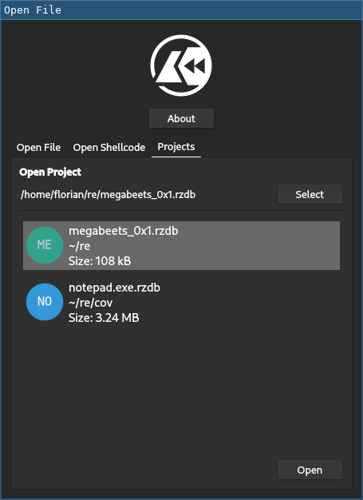

When manually analyzing a complex binary, possibly over the course of days, weeks or even months, it is crucial to
be able to keep track of the gained knowledge through annotations such as comments, function and variable names.
As such, the tool one is working with also need to provide a reliable and future-proof way to save and restore
this information. One of the biggest additions in Rizin surely is the new projects feature, which provides
exactly this functionality in both rizin on the command line and Cutter.
In this article, we would like to give an overview of how it was designed, what exactly it promises to you,
as well as the current limitations you should be aware of when using it right now.

## tl;dr

* Projects can be used in rizin using the `Ps [<project.rzdb>]` and `Po <project.rzdb>` commands and in Cutter through
  its regular user interface.
* Projects are currently in **beta**, including in any `0.x.y` releases of Rizin,
  and will be considered **stable** starting with release `1.0.0`.
  * **Beta** means that all functionality is implemented and ready to use, but there is no guarantee that
    the format itself will not further change slightly and thus maybe break loading a project saved right now
	in a future version of Rizin.
  * **Stable** means that the format is finalized and all changes inside of it will come with migrations and tests
    ensuring that all projects saved before are still be loaded correctly.
* Projects may be conceptually split into two parts: the binary that is being analyzed, and
  any info that has been put on top by automatic analysis or the user.
  * Saving and loading of all analysis data on top of a binary, including flags, functions,
    variables, types, comments is implemented.
  * Automatic reloading of the underlying binary is currently limited to only a single binary available as a regular file,
    but this will be extended to arbitrarily complex IO mappings in the future.
	However, even with the current state, it is possible to manually reconstruct more complex mappings and then load
	any analysis data on top using the `Poo <project.rzdb>` command.

## Wait, weren't there already projects in Radare2 before?

Indeed, there has been a projects feature in Radare2 since 2017. This has been removed entirely from Rizin
and is now entirely replaced by the new implementation, which has been re-designed from scratch and shares no code
with the old one.

To understand why such a radical change was necessary, let us take a closer look at how old projects were designed.
They primarily consisted of a single `rc` file, which was a radare2 script containing regular commands that would
reconstruct the session state when run. As an example, a part of such a script to load one function could look like this:
```
"f main 127 0x080485f5"
"af+ 0x080485f5 main s n"
afb+ 0x080485f5 0x080485f5 54 0x08048655 0x0804862b
afb+ 0x080485f5 0x0804862b 24 0x08048655 0x08048643
afb+ 0x080485f5 0x08048643 18 0x08048665 0xffffffffffffffff
afb+ 0x080485f5 0x08048655 16 0x08048665 0xffffffffffffffff
afb+ 0x080485f5 0x08048665 15 0xffffffffffffffff 0xffffffffffffffff
```

We can see it is first creating a flag (`f`), then creating a function (`af+`)
and finally adding basic blocks to it (`afb+`).

While this general approach can work in theory, it comes with several implications:

* Commands can have side effects. As an example, until only very recently, the `afb+` command would trigger a heavy function
  analysis loop after adding a basic block in some circumstances, creating variables, X-Refs and other information.
  The information coming out of this side effect would then mix with the rest of the restored session, resulting for example
  in unwanted variables being present after loading.
* Commands and their semantics can change over time. Simple changes include command name changes or the order of arguments,
  more complex ones may involve major restructuring of underlying concepts, thus requiring entirely different command sequences
  to achieve the same results.
  Of course, since the saving instance can not predict the future, it would be solely the responsibility of loading
  instance to account for such changes.
  However with the project being an unstructured sequence of commands that may not even be part of the codebase anymore
  at this point, performing such a migration is far from trivial and highly error-prone.

Moreover, before rizin's new command parser was created, there was no formal specification of the command syntax.
You can see in the above example that the first `af+` command is enclosed in `"..."`, which is to account
for cases such as the function name being `ma;in` where otherwise the `;` would be interpreted as a separator for a new
command, similar as in an SQL injection, eventually resulting in broken project loading.
However, this quoting scheme still fails for names such as `ma"in`.
As mentioned, this could have been eventually fixed using the new command parser, which has a well-defined escaping syntax,
but it still has been the source of many bugs in the past.

On top of all these fundamental issues comes the fact that these projects were never tested apart from very few
integration tests covering only a tiny fraction of the information potentially included in a session.
All these aspects combined led to a high density of bugs and uncertainty when working with this feature.
If you were very lucky, the project would save and load as expected. If you were less lucky, the loading
would simply result in an error. But, and this has been the most likely case, if you were unlucky,
the project would load seemingly correctly, but you would notice only later that the loaded data was deeply corrupted.

Despite some of these issues being theoretically possible to fix, the conceptual problems of using commands
for projects remain. Because the ability to save a session is only even remotely useful when it can also be relied
upon to always correctly restore it in the future, a different approach had to be taken here,
hence requiring an entire rewrite of the feature.
This new approach, detailed in the following section, takes concrete learnings from the mistakes of the previous approach
and thus avoids all problems mentioned above right from the start.

## Design

Projects take a classic, fully declarative approach to store their information, saving and loading a direct dump of
the internal state.

### Serialization

All relevant modules and data structures now have serialization and deserialization functions added, commonly prefixed
with `rz_serialize_` and implemented in files called `serialize_*.c`, as for example 
[`serialize_flag.c`](https://github.com/rizinorg/rizin/blob/adc5fb8a08e88732939e4fb7643b90af195c797e/librz/flag/serialize_flag.c)
in the case of flags.

For the target data structure, SDB is being used, which is a database that is also used in other parts of rizin.
What makes SDB special is its simplicity: One SDB is simply a mapping from arbitrary string keys to string values, and
multiple SDBs can be nested in a tree of namespaces.
This restricted design makes SDB unsuitable for many applications, but for our projects it turned out to fit very well.
Inside such an SDB, when more complex structures are needed, JSON is used.
This combination of well-defined formats means we can rely on them and forget about escaping or sanitizing strings in our
actual serialization code.

For example, the same function as in the previous example would now be serialized like this:
```
/core/analysis/functions
0x80485f5={"name":"main","bits":32,"type":4,"cc":"cdecl","stack":16,"maxstack":32,"ninstr":43,"bp_frame":true,"bp_off":8,"diff":{},"bbs":[134514165,134514219,134514243,134514261,134514277],"vars":[{"name":"argv","type":"char **","kind":"s","delta":4,"arg":true,"accs":[{"off":0,"type":"r","sp":4,"reg":"esp"}]},{"name":"var_8h","type":"int32_t","kind":"b","delta":-16,"accs":[{"off":117,"type":"r","sp":18446744073709551608,"reg":"ebp"}]}]}

/core/analysis/blocks
0x80485f5={"size":54,"jump":134514261,"fail":134514219,"traced":true,"ninstr":18,"op_pos":[4,7,10,11,13,14,15,17,20,25,30,33,36,41,46,49,52],"stackptr":16,"parent_stackptr":0,"cmpval":1}
0x804862b={"size":24,"jump":134514261,"fail":134514243,"traced":true,"ninstr":9,"op_pos":[3,6,8,11,12,17,20,22],"stackptr":16,"parent_stackptr":16}
0x8048643={"size":18,"jump":134514277,"traced":true,"ninstr":5,"op_pos":[3,8,13,16],"stackptr":16,"parent_stackptr":16}
0x8048655={"size":16,"jump":134514277,"traced":true,"ninstr":4,"op_pos":[3,8,13],"parent_stackptr":16}
0x8048665={"size":15,"traced":true,"ninstr":7,"op_pos":[5,8,9,10,11,14],"parent_stackptr":0}
```

While this certainly is harder to read for humans, it follows a clearly defined structure and all relevant information
can be extracted from it directly.
This kind of serialization design now also allows unit tests to be written easily and in fact all currently implemented
serializations already come with such tests, aiming to ensure that all internal state is correctly saved and loaded,
down to even subtle details and corner cases.

What you see above is already an example of how the serialization will eventually be saved to a file.
It is a simple, text-based format that stores the SDB entries line by line and takes care of any necessary escaping.
While such a text-based format may not be the most efficient representation, it turned out to be more than good enough
for even larger projects and in addition has certain nice properties, which we will make use of further down.
However, due to the simplicity of SDB, other file formats to store the same data are theoretically feasable too.

### Versioning

An important aspect is that the possibility to correctly load a project will survive even significant updates of the software.
To ensure this, a simple version-based migration approach is used: The project code contains a version number defined as
[`RZ_DB_PROJECT_VERSION`](https://github.com/rizinorg/rizin/blob/adc5fb8a08e88732939e4fb7643b90af195c797e/librz/core/project.c#L10),
which is simply an integer that is increased every time there is a change in the format.
This number is then simply saved into every project's metadata namespace.

Later, when loading the same project in newer rizin that also has a higher internal project version number,
it will be able to know exactly the kind of format that the old project was saved with and will be able to upgrade it by
successively applying migrations, which will be implemented along every increase of the project version number.

At the current point in time, the version number is `1` and there are no migrations. This is because at the moment,
the projects feature is considered to be in a **Beta** phase, allowing it to be tested thoroughly and still
receive changes to the format that might turn out sensible without the additional engineering overhead of implementing
migrations.

This means that right now, everybody is highly encouraged to test projects and report any issues that might come up,
but be aware of the fact that compatibility with later rizin versions may not be guaranteed and might require
small manual edits in the serialized file.

The **Beta** phase will continue throughout all `0.x.y` versions of rizin and end by version `1.0.0` where
projects will be considered **stable**, meaning that all projects should always be properly loaded in all future versions
and if a case is discovered where this promise is not held, it will be considered a bug and shall be fixed.

### Re-loading of underlying binaries

One of the trickiest aspects of serializing a rizin session is handling the actual underlying binary that is being
analyzed. In fact, speaking of "the binary" in this context is a crude underapproximation of what is actually present
in Rizin.

Ignoring debug, three modules are working together to load files: `RzIO` provides a
generic IO layer, which can map data coming from plugins in a 64-bit address space.
`RzBin` takes raw files from `RzIO`, parses their binary file formats such as ELF or PE,
also using an independent plugin for each, and eventually provides information how to then
lay out the contained sections in `RzIO` again, along with a list of symbols and other information parsed from the binary.
`RzCore` controls how these modules are created and work together.

This design makes rizin's loading mechanism very powerful and flexible, but imposes certain challenges on serialization:
How to handle all the different IO plugins? Next to the one that simply loads a regular file, there are plugins for
files in zip, malloc, http, shared memory, ... that all need individual reconstruction logic.
For regular files, how to relocate the actual file when the project is moved to another machine?
From `RzBin`, should the symbols information also be serialized or re-parsed?

Because this part needs to be designed properly first and might even require some refactoring in the respective
modules, its implementation has been postponed for now.
But the preliminary, rough plan is the following:
Every IO plugin itself provides callbacks for (de)serialization of maps created with it.
All IO maps are serialized to the file using these callbacks.
Information in `RzBin` will not be serialized but re-parsed on top of the deseralized IO maps.

However, despite this full implementation being postponed, a very simple temporary solution has been implemented,
which is strictly limited to the case where only **a single binary** is loaded from a **regular file**
with the **default loading settings**, i.e. without explicitly specifying the base address for example.
This makes it possible to use projects conveniently right now for the majority of use-cases.
More complex cases are also already possible, as long as the loading process is done manually and the project
is then loaded on top using the `Poo <file.rzdb>` command, as shown in the following section.

## Usage

Saving and loading projects from rizin is as simple as it can be:
```shell
[0x00000000]> P?
Usage: P<so?>   # Project management
| Ps [<project.rzdb>] # Save a project
| Po <project.rzdb>   # Open a project
| Poo <project.rzdb>  # Open a project on top of currently loaded binaries
```

Use `Ps [<project.rzdb>]` from a running session to save it and `Po <project.rzdb>` to discard the current
session and load the saved one.
Alternatively, a project can also be loaded directly when starting rizin like `rz -p project.rzdb`.

`Po` and `-p` will also take care of loading the single, underlying binary as explained in the previous section.
If this is not desired, you can use the `Poo <project.rzdb>` command to keep all current state of IO mappings and
parsed binaries in place and only load the analysis information on top.

In Cutter, simply use the `File -> Save Project...` menu entry or `Ctrl+s` shortcut to save
and the `Projects` tab in the initial dialog to open a project:

<div style="display: flex; justify-content: space-evenly; align-items: center; flex-flow: row nowrap;">
	<div style="margin: 8px;"></div>
	<div style="margin: 8px;"></div>
</div>

Cutter will also ask you to save the project before quitting so no work will get lost by accident.

For the case explained before, where the project depends on more complex mappings than a single binary file,
or if the same project should be loaded on top of another binary, the `Poo <project.rzdb>` can be used.
For example, this is how a project can be loaded on top of two files:
```shell
$ rizin --                            # start rizin without any file
[0x00000801]> on crackme.bin 0x7ff    # load first file at 0x7ff
[0x00000801]> on kernal.bin 0xe000    # load second file at 0xe000
[0x00000801]> Poo crackme.bin.rzdb    # load project on top
[0x00000815]> pd 1                    # disassemble inside the first file
            0x00000815      jsr CHROUT_in_kernal ; this is a call from crackme.bin into kernal
[0x00000815]> pd 1 @ CHROUT_in_kernal # disassemble inside the second file
            ;-- CHROUT_in_kernal:
            0x0000ffd2      jmp (0x0326)
```

## Version Control and Collaboration

If you have used Ghidra before, you might have come across its "shared project" and Ghidra server, which
are its strong, built-in features for collaborative reverse engineering with version control.
Rizin takes a different approach to provide this functionality that is more in line with its UNIX-like focus.
It does not implement version control itself, but instead creates project files in a way that they
can work well with existing version control systems like git, which are well-tested
and likely to already be familiar for users.

Being text files where independent content is generally split by lines, git already knows how to deal with
tracking differences and merging for these files most of the time.
This is for example a diff of a project where the current seek was changed and a comment added:

```diff
diff --git a/megabeets_0x1.rzdb b/megabeets_0x1.rzdb
index 9c828f4..aed7e64 100644
--- a/megabeets_0x1.rzdb
+++ b/megabeets_0x1.rzdb
@@ -4,7 +4,7 @@ version=1
 
 /core
 blocksize=0x100
-offset=0x8048370
+offset=0x8048600
 
 /core/analysis
 
@@ -158,6 +158,7 @@ watcom=cc
 0x804859a=[{"type":"t","str":"char *dest"}]
 0x80485db=[{"type":"t","str":"const char *s2"}]
 0x80485e2=[{"type":"t","str":"const char *s1"}]
+0x8048600=[{"type":"C","str":"I am putting a comment here!"}]
 0x8048609=[{"type":"t","str":"const char *s"}]
 0x8048619=[{"type":"t","str":"const char *s"}]
 0x8048646=[{"type":"t","str":"const char *s"}]
```

Examining these json-based diffs surely is not be the most convenient way to view differences for every user, but
it provides a working compromise between readability for both humans and software at the same time without
requiring any programs except git up to this point.
In addition, we are investigating implementing custom diff- and mergetools that could be integrated into git and are
fully aware of the meaning of data in project files to present and merge differences in the best way possible while
still relying on an existing version control system.

Regarding the binary that is being analyzed in a project, if desired, it can also be put into the same git repository
as the project. Since projects contain a reference to the binary file relative to the project file, it can still be
re-loaded when moved to another machine.

## Conclusion

We hope you will enjoy using rizin with its new projects feature. If you are interested, we highly encourage you
to try it out, put it through its paces, and [report](https://github.com/rizinorg/rizin/issues) any
potentially upcoming issues, so we will be able to iron them out until the end of the beta phase!
